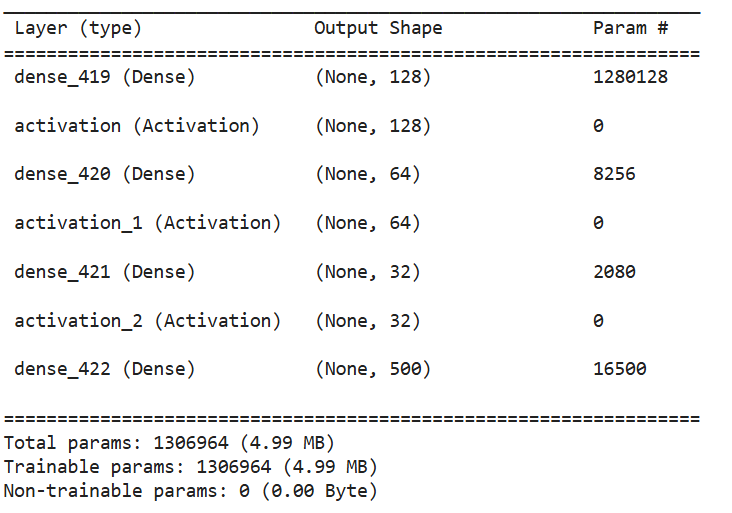
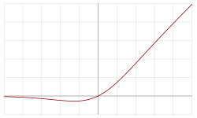
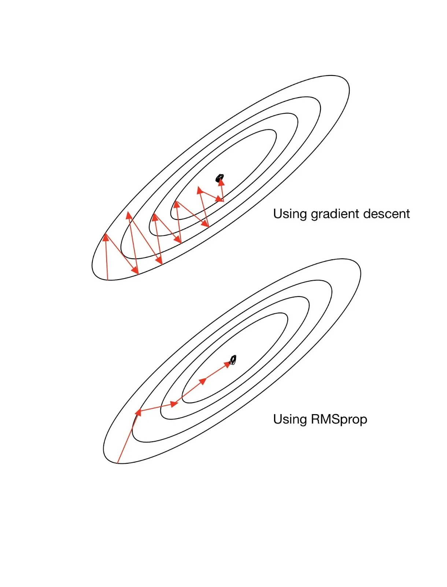
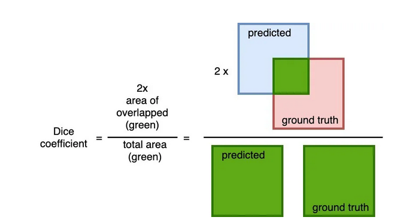
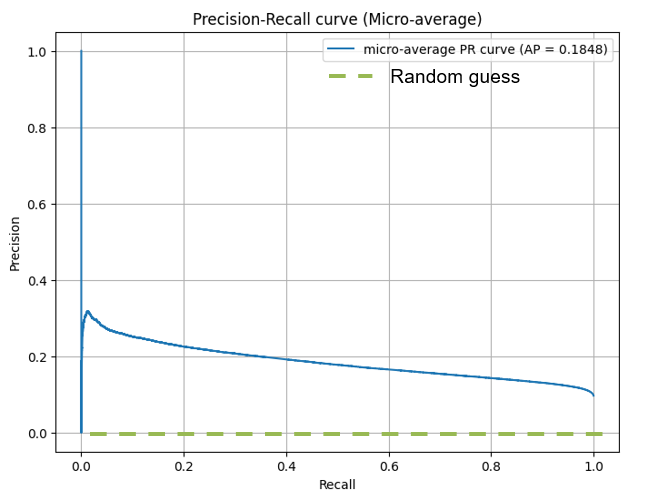

# Chromatin Accessibility Prediction (scATAC-seq)
Based on Gene Expression (scRNA-seq) using Deep Learning

Avishai Wizel
2025

---
# Introduction
🎯 **Problem Definition**
In the cells of multicellular organisms, gene expression (i.e., the conversion of genetic information into protein) is also influenced by epigenetic factors—such as the opening or closing of DNA regions, a process called **chromatin accessibility**.
**scRNA-seq** is a method for measuring gene expression in each individual cell.
**scATAC-seq** measures the accessibility of regulatory regions in the genome within each individual cell.

---
# Goal
The goal is to **predict** chromatin accessibility patterns (scATAC-seq) based on the gene expression profile (scRNA-seq) of each cell.
**Advantage:** The ability to predict scATAC based on scRNA can help understand regulatory mechanisms even when ATAC data is not available—saving time and money, and yielding additional information from existing data.

---
# Why Deep Learning?
We chose a **Deep Learning** approach because the relationship between gene expression and chromatin accessibility is complex, non-linear, and may involve multiple gene-to-gene interactions.
Simpler models like Regression or Random Forest fail to optimally learn such relationships.
Deep Learning allows the network to gradually learn abstract representations of the data, even without precise prior knowledge about the nature of the relationship.

---
# Why a Fully Connected (Dense Neural Network)?
We considered other options like CNN (Convolutional Neural Network), but these are better suited for data structured spatially or temporally (like images or sequences).
In our case, each cell is represented as a **one-dimensional vector** of gene expression, without spatial structure. Therefore, CNN is not suitable for the data structure, and a **Fully Connected Neural Network** is the natural and simpler choice.

---
# ⚠️ Key Challenges
* **Sparsity:** The target matrix (scATAC-seq) is very sparse—almost all values are 0 (no accessibility). This makes it difficult for the model to learn a significant difference.
* **Class Imbalance:** Only a small percentage of loci are open (1) versus closed (0).
* **Imperfect Correspondence:** There isn't always a direct match between gene expression and the accessibility of specific regulatory sites.
There is a fundamental gap between the two data types, making this a non-linear problem that requires Deep Learning.

---
# Data
10K PBMC (Peripheral Blood Mononuclear Cell) cells from a healthy donor
Single Cell Multiome ATAC + Gene Exp. Dataset sequenced by 10X.

---
# Filtering and Normalization
There were originally 11,852 cells. After Quality Control (QC), 11,680 remained.
Of these, I used the **10,000 genes** with the highest variance.
The prediction target was **500 loci** from the scATAC also selected based on high variance.
The scRNA-seq data underwent **Z-score scaling**—bringing each gene to a mean of 0 and a standard deviation of 1.
The scATAC-seq data was converted to a **binary format (0/1)**, thus no normalization was strictly required, but **MinMaxScaler** was performed for technical purposes (encoding values between 0 and 1).

---
# Additional Data Details
I reserved **20%** of the cells for the test set, and used an additional **10%** for validation during training in each epoch.
Training was performed on an **NVIDIA L4 GPU** using Python and Keras over **50 epochs**, with a **batch size of 32**.

---
# 🧠 Network Architecture
The network was a simple fully connected network:

---
# Activation Functions
**Swish:** An innovative activation function that combines Sigmoid and ReLU. It allows for smoother gradient flow and can improve learning.
**Sigmoid:** An activation function that returns a value between 0 and 1—often used in probability estimation.
**Final Output:** A vector of size **500** for each cell, representing the probability of an open peak (1) at each locus.

---

# ⚙️ Model Training
**Batch size:** In each training step, the model only sees 32 examples from the total data—learning gradually. This improves the stability and efficiency of the training.
I used a variety of optimizers, and ultimately chose **RMSProp**, which showed the best performance.
RMSProp is suitable for noisy data or data with inconsistent gradients, and dynamically adjusts the learning rate. It retains information about past gradients similar to Momentum but also computes an exponential moving average of the squared gradients.

---
# 📉 Loss Functions
To handle the imbalanced and sparse data, I used a combination of two functions:
**SigmoidFocalCrossEntropy** - A loss function that focuses on "hard" examples and partially ignores "easy" (frequent) ones—like the zeros in the ATAC matrix. This improves sensitivity to rare events.
**Dice Loss** - Similar to the F1 score. It is designed to maximize the overlap between truth and prediction, making it highly suitable for **sparse data**.

---
# 📈 Performance Evaluation Metrics
The central metric I used to evaluate performance was **PR AUC (Precision-Recall Area Under Curve)**, which is particularly suitable for problems where the data is highly imbalanced against the positive class.
**What it measures:**
PR AUC is the area under the Precision versus Recall curve, and it is a measure especially suited for problems with **unbalanced data**, meaning there are many more negative examples (0) than positive examples (1).
**Precision (Positive Predictive Value):** How many of the predictions the model said were positive were actually correct.
**Recall (Sensitivity):** How many of the true positive examples were correctly identified.

---
# 📈 Performance Evaluation Metrics
**Intuition:**
The PR AUC metric checks how well the model succeeds in correctly identifying positive examples while maintaining a low number of errors.
If the model identifies many positives but also makes many mistakes—Precision will decrease.
If it's conservative and identifies few positives—Recall will decrease.
The PR curve shows the **trade-off** between the two when changing the threshold.
**What is the PR AUC value when there is no learning at all?**
If the model learns nothing and just guesses—the PR AUC value will be approximately equal to the fraction of positives in the data.
For example: If only 10% of the examples are positive, then random PR AUC $\approx 0.10$.
In this project, the rate of 1s in the scATAC matrix was very low.

---
# 📈 Performance
We achieved a PR AUC of approximately **0.18**, which is considered relatively low—but still significantly higher than the percentage of positives (i.e., not random).

Therefore, a value of $\approx 0.18$ shows that the model **did learn something**—even if not particularly impressive performance.

---
# 📈 Performance
There are several possible reasons why the result was not higher:
**Extreme sparsity of the scATAC matrix:** Most values are 0, making it easy for the model to "play it safe" and predict only zeros. Even advanced methods struggle in such cases, especially when there is insufficient representation of positives.
**Limited training cell count:** We used approximately 9,000 cells for actual training. In Deep Machine Learning terms, this is a relatively small amount, especially with an output of 500 units.
**Lack of external regulatory information:** The model was only fed scRNA and did not know, for example, the **proximity** of genes to loci, or which loci are known **enhancers**—information that could have helped model real biological connections.

---
# 📈 Performance
**Limited runtime:** Training was performed for only 50 epochs, partly to maintain reasonable runtime. A deeper model, or more epochs, might have improved performance.
**Relatively simple model design:** The network was based solely on Fully Connected layers, without Dropout layers, internal normalization, or other regularization mechanisms.
**Imperfect correspondence between RNA and ATAC:** Even biologically, not every gene expression is directly reflected in chromatin accessibility in the same cell, so there is an inherent limitation in how well ATAC can be predicted based solely on RNA.
Despite the challenges, the fact that the model succeeded in identifying significant patterns and recovering some of the accessibility—even if a small part—indicates that the connection exists and is learnable, even if not fully.

---
# Statistical Test (Fisher's Exact Test)
To validate the model's results, I used an additional statistical method:
I selected a **threshold** on the predictions and made them binary. Then:
I counted how many loci were marked as "accessible" in both the prediction and the ground truth (overlap).
I created a contingency table and compared using **Fisher’s Exact Test**:

The result: **p-value $\approx 0$** and **odds ratio $\approx 3$**, meaning the model correctly predicted accessible regions in a **statistically significant** manner.
**Therefore:**
* Although there are many **False Positives (260K)**, there is still a very significant signal in the predictions.
* This is reasonable with sparse data like ours (many 0s), which is why choosing the correct threshold and measuring with appropriate metrics like PR AUC is crucial.

| Predicted 0 | Predicted 1 |  |
| :---: | :---: | :---: |
| 56532 | 56335 | **True 1** |
| 794347 | 260786 | **True 0** |

---
# 7. Ideas for Future Work 🛠
* Add **Batch Normalization** or **Dropout** to the hidden layers.
* Explore an **Autoencoder** or **Transformer** for discovering hidden representations.
* Perform **feature selection** using models like LASSO or Random Forest, or using biological characteristics.
* Try mapping to a **shared genomic/ontological space** between RNA and ATAC.
* Add RNA features of types that are more indicative of regulatory activity, such as **RNA from enhancers (eRNA)**.
